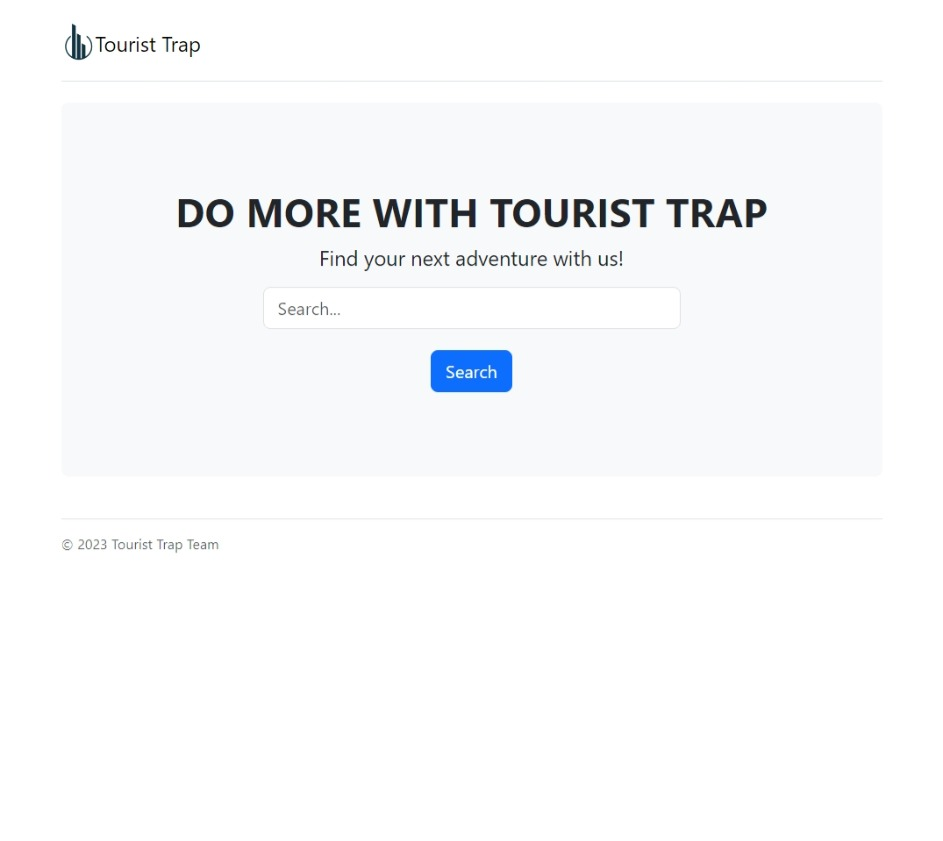
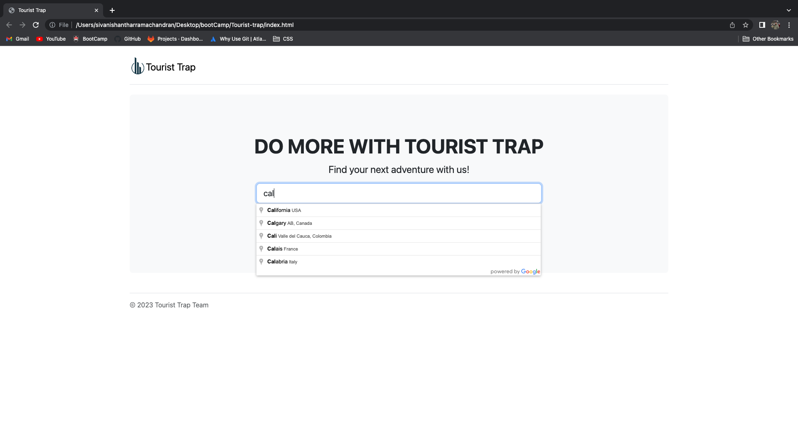
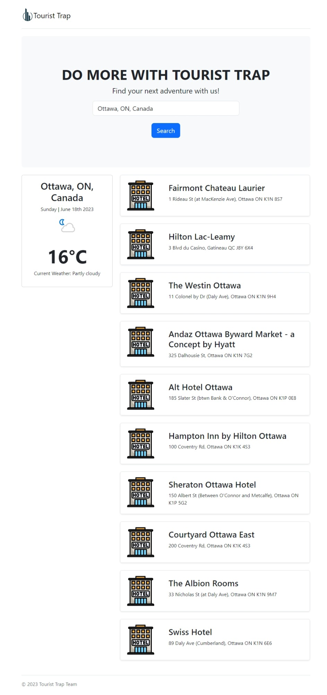
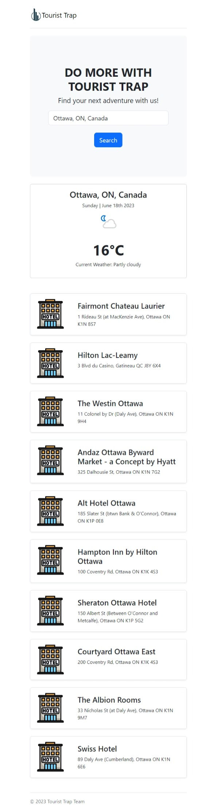

# Tourist-trap

## Description

Tourist trap is a webpage that will give you a list of ten hotels within the city of your choice and display the current weather in that city. It is meant to aid travelers in finding a place to stay while they are planning a trip or vacation. Names and addresses of the hotels are provided so that travelers can look for a hotel that is close to where they want to be.

## Table of Contents

- [Installation](#installation)

- [Usage](#usage)

- [Credit](#credit)

- [License](#license)

- [APIs](#apis)  

- [Contributing](#contributing)

- [Deployment](#deployment)

- [References](#references)

## Installation

N/A

## Usage

A user will type the name of a city into the search bar. City names are available in an autocomplete dropdown box. For cities with the same name in multiple countries, users can find the city they are looking for by adding the country information after a comma or by selecting it from the autocomplete dropdown. E.g., Kingston, Canada vs. Kingston, Jamaica.

Upon clicking the search button, the current weather will appear, followed by a list of ten hotels in or near the city with some basic information.

Home Page on arrival  

Example of the search field auto-fill functionality  

Web Page after search has been performed  

Web Page mobile view after a search  

## Credit

Ali Sharabiani

## License

N/A

## APIs

Foursquare API

Weather API

Google Places API

## Contributing

[Emmanuel Appiagyei](https://github.com/WDverse)

[Sivanishanthar Ramachandran](https://github.com/sivanishanthar)

[Matthew Taylor](https://github.com/Shippo704)

## Deployment

Here is the link to the webpage:  

[Tourist Trap](https://wdverse.github.io/Tourist-trap/)

## References

[This site helped to format the fetch request for the foursquare api](https://maximorlov.com/tips/convert-curl-to-javascript-fetch/)

[This site helped fix an error that appeared in the foursquare API fetch request](https://stackoverflow.com/questions/51017702/enable-cors-in-fetch-api)
